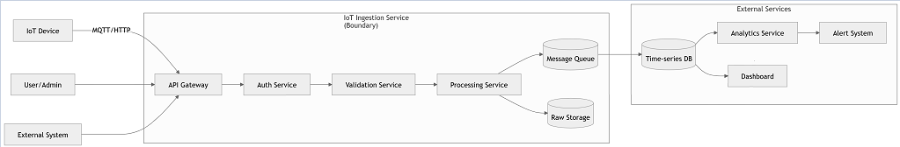

# Service Boundary của nhóm

## 1. Thông tin nhóm

- Tên nhóm:3b
- Lớp:CNTT 17-10
- Thành viên:
- Đỗ Công Ngọc Sơn  
- Hà Thị Phương Thanh  
- Nguyễn Thị Thu Vui  
- Đinh Mạnh Đà  

- Service nhóm phụ trách: IOT Ingestion Service
- Sản phẩm tổng thể của lớp: Hệ thống quản lý và phân tích dữ liệu IoT

## 2. Actor

Các đối tượng tương tác với hệ thống:

- 📡 Thiết bị IoT (sensor, nhiệt độ, độ ẩm...)  
- 👨‍💻 Người dùng (Admin / User)  
- 🌐 Hệ thống bên thứ ba (External Systems)  

## 3. System Boundary

Nhóm em xây phần nào?

Phần nhóm kiểm soát:
- API Gateway (tiếp nhận dữ liệu)  
- Authentication Service (xác thực thiết bị)  
- Data Validation Service (kiểm tra dữ liệu)  
- Data Processing Service (xử lý dữ liệu)  
- Message Queue (Kafka / MQTT)  
- Raw Data Storage  

- ...

Phần nhóm chỉ tích hợp:
- Time-series Database  
- Analytics Service  
- Dashboard / Monitoring  
- Alerting System  
- ...

## 4. Service Boundary

Service của nhóm có trách nhiệm gì?
- Nhận dữ liệu từ thiết bị IoT (HTTP / MQTT)  
- Xác thực thiết bị (API Key / Token)  
- Kiểm tra dữ liệu hợp lệ  
- Xử lý và chuẩn hóa dữ liệu  
- Đẩy dữ liệu vào Message Queue  
- Lưu dữ liệu thô (backup)  
Service KHÔNG làm gì?
- Không phân tích dữ liệu (Analytics)  
- Không hiển thị giao diện người dùng  
- Không xử lý cảnh báo (Alert)  
- Không lưu trữ dài hạn dữ liệu đã xử lý  
## 5. Input / Output

### Input

- ...

### Output

- ...

## 6. API dự kiến

| Method | Endpoint | Mục đích               |
| ------ | -------- | ---------------------- |
| GET    | /health  | Kiểm tra service       |
| POST   | /ingest  | Nhận dữ liệu IoT       |
| POST   | /auth    | Xác thực thiết bị      |
| GET    | /devices | Lấy danh sách thiết bị |
| GET    | /logs    | Xem log dữ liệu        |


## 7. Phụ thuộc service khác

Service này gọi đến service nào?
- Authentication Service
- Message Queue (Kafka / MQTT Broker)
- Storage Service
Service nào gọi đến service này?
- IoT Devices
- External Systems
- User / Admin
## 8. Sơ đồ minh họa

Có thể vẽ bằng Mermaid, draw.io, Ludichart hoặc ảnh chụp sơ đồ.
](image.png)
```mermaid
flowchart LR
    User[Actor] --> Service[Service của nhóm]
    Service --> DB[(Database)]
    Service --> Other[Service khác]
